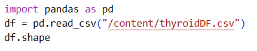
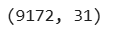
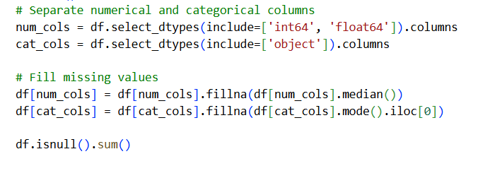
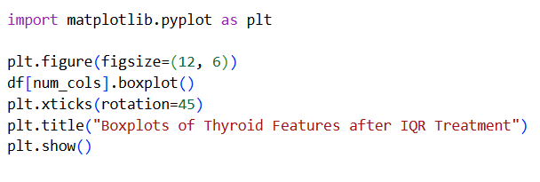
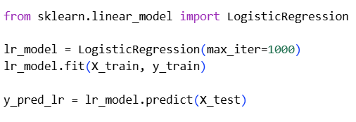
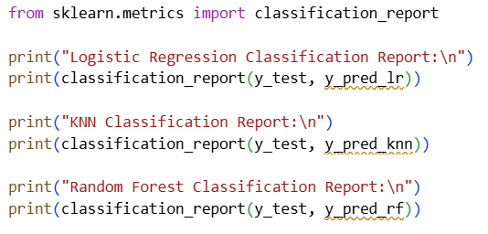
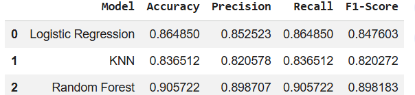

# Thyroid Disease Classification Model

A machine learning project built as part of my coursework (BSc. Computer System Engineering), where I trained and compared classification models to predict thyroid disease from patient clinical data, framed around a healthcare scenario for a company called HealthShield.

> Note: My original Colab notebook was lost, so this repo documents the project using code and output screenshots from my submitted assignment, along with a summary of the approach and results.

## Problem

Thyroid disorders are common but can be time-consuming to diagnose manually. The goal was to build a model that could classify a patient's thyroid condition from their clinical and demographic data, to support (not replace) diagnostic decisions.

## Dataset

- **9,172 patient records, 31 columns** (30 input features + 1 target class)
- Mix of numerical data (age, hormone levels) and categorical data (medical history, referral source, treatment flags)
- Loaded and explored using Pandas in Google Colab

## Data Cleaning & Preprocessing

- Handled missing values, numerical columns filled with median, categorical columns filled with mode
- Detected and treated outliers using the IQR method
- Encoded features: binary encoding, label encoding (target), and one-hot encoding (referral source)

## Models Trained

I trained and compared three classification algorithms using Scikit-learn:

- **Logistic Regression**
- **K-Nearest Neighbors (KNN)**
- **Random Forest**

## Evaluation

Each model was evaluated using accuracy, precision, recall, F1-score, and confusion matrix analysis on a held-out test set.

| Model | Accuracy | Precision | Recall | F1-Score |
|---|---|---|---|---|
| Logistic Regression | 0.865 | 0.853 | 0.865 | 0.848 |
| KNN | 0.837 | 0.821 | 0.837 | 0.820 |
| **Random Forest** | **0.906** | **0.899** | **0.906** | **0.898** |

## Result

**Random Forest performed best across all metrics.** As an ensemble method, it combines many decision trees, which made it more robust to the noise and class imbalance in the clinical data than a single linear model (Logistic Regression) or a distance-based model (KNN). Logistic Regression was the most interpretable of the three, which is also valuable in a healthcare context, but Random Forest gave the strongest and most balanced predictive performance overall.

## Tools Used

Python · Pandas · NumPy · Matplotlib · Scikit-learn · Google Colab

## What I'd Improve Next

The models were evaluated on a single train/test split. Using k-fold cross-validation would give a more reliable estimate of how the model performs on unseen data, and is something I'd add if I revisited this project.
